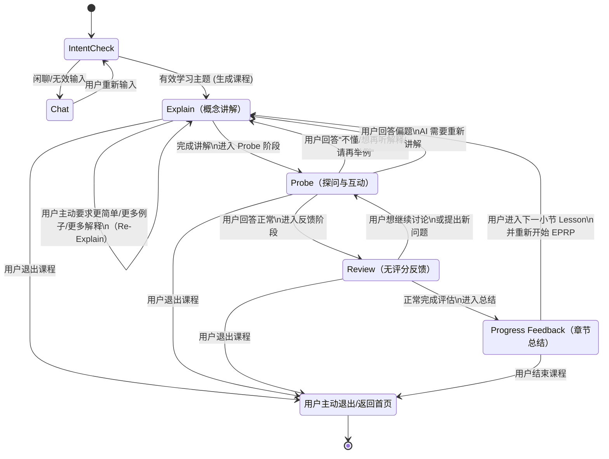

# 🎯 **Ranedeer AI Studio – EPRP Lesson Engine State Machine**

## 👉 总目标：

**EPRP（Explain → Probe → Review）单元在 Ranedeer 中始终以 Progress（总结）阶段收尾，因此完整教学循环为 `Explain → Probe → Review → Progress`。**
所有 Lesson 都由这样的 EPRP Unit + Progress 组成，每节课执行 1 个完整循环。

---

## 🧠 **Mermaid 状态机**



---

## 🧩 **解释各个状态**

---

### ⬜ **0. Chat（闲聊/引导阶段）**
 
这是进入正式学习前的状态。当用户输入非学习主题（如"你好"）时触发。
*   **行为**: AI 进行简短回复并引导用户输入学习主题。
*   **转移**: 用户再次输入 -> 重新进行意图识别。
 
---
 
### 🟦 **1. Explain（讲解阶段）**


Explain 状态负责提供：

* 当前 Lesson 的核心概念
* 简单例子
* Why it matters
* 轻度视觉化表达（如果 Student Model 表示用户是视觉型）

#### Explain 状态可触发的转移：

| 来源      | 条件             | 目标状态                  |
| ------- | -------------- | --------------------- |
| Explain | 讲解完成           | → Probe               |
| Explain | 用户说“不懂”“再详细一点” | → Explain（Re-Explain） |
| Explain | 用户退出课程         | → Exit                |

---

### 🟦 **2. Probe（探问阶段）**

Probe 是一个互动阶段，不是测验。

Probe 用于：

* 测试理解程度
* 激发思考
* 获取用户输入
* 决定是否需要 Re-Explain

#### Probe 状态可触发的转移：

| 来源    | 条件               | 目标状态                  |
| ----- | ---------------- | --------------------- |
| Probe | 用户回答正常           | → Review            |
| Probe | 用户表示“不懂/再解释/再举例” | → Explain（Re-Explain） |
| Probe | 用户回答偏题           | → Explain             |
| Probe | 用户退出课程           | → Exit                |

---

### 🟦 **3. Review（反馈阶段）**

Review 是对用户回答的“暖反馈”，具有：

* 积极鼓励
* 温和纠偏
* 小补充
* 无评分、无对错、无评价

#### Review 状态可触发的转移：

| 来源       | 条件           | 目标状态       |
| -------- | ------------ | ---------- |
| Review | 用户继续讨论/进一步提问 | → Probe    |
| Review | 正常完成反馈       | → Progress |
| Review | 用户退出课程       | → Exit     |

---

### 🟦 **4. Progress Feedback（章节总结）**

这是 EPRP 的收尾阶段，负责提供：

* 所学内容总结
* 正向鼓励
* 下一个 lesson 的导航

#### Progress 状态可触发的转移：

| 来源       | 条件        | 目标状态           |
| -------- | --------- | -------------- |
| Progress | 用户点击“下一节” | → Explain（下一节） |
| Progress | 用户决定退出    | → Exit         |

---

## 🔄 **EPRP Unit 的循环逻辑（核心精华）**

你可以把一个完整循环看成：

```
┌────────────┐
│   Explain   │
└──────┬─────┘
       ▼
┌────────────┐
│   Probe     │
└──────┬─────┘
       │  正常回答
       ▼
┌────────────┐
│  Review   │
└──────┬─────┘
       ▼
┌────────────┐
│  Progress   │
└──────┬─────┘
       │ 下一节
       ▼
  (回到 Explain)
```

但注意：

### Probe 与 Explain 之间存在循环：

```
Probe → Explain → Probe → Review → Progress
```

这是 AI 导学的自然形态。

---

## 📌 为什么必须允许 EPRP 循环？

因为用户的情况永远是：

* 讲解 → 不懂
* 讨论 → 需要例子
* 例子 → 发现偏题
* 提问 → 需要更清晰结构

这个循环结构：
✔ 像一个真实老师
✔ 非线性
✔ 高度灵活
✔ 不会触发“教育评估”监管
✔ 是成人学习者最自然的方式
✔ 是 AI 的最大价值点
